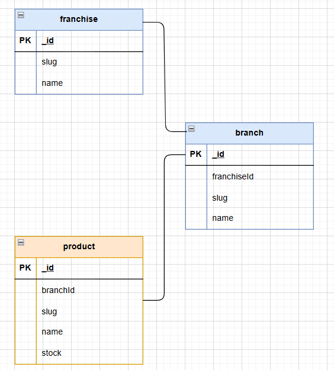
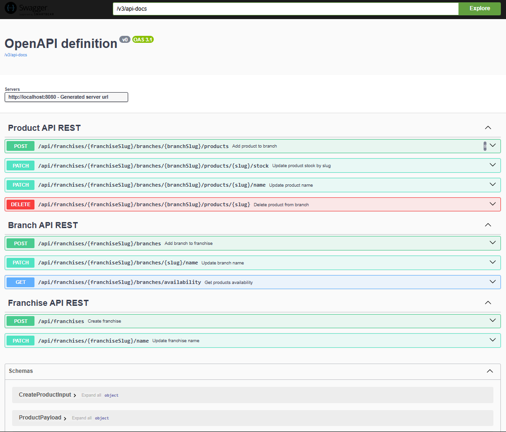
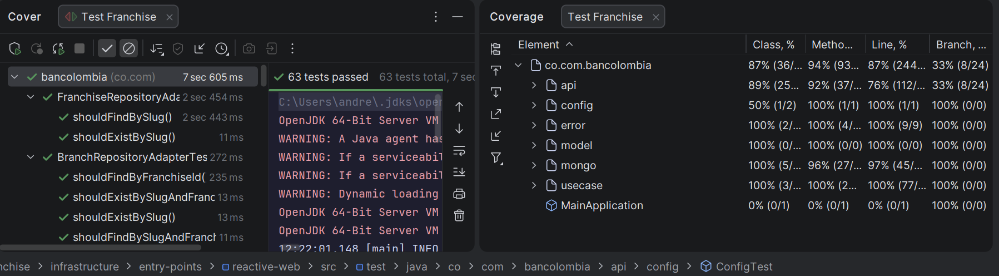

# Proyecto Franchise, prueba técnica SETI

Este proyecto es el desarrollo de la prueba técnica para la vacante de lider técnico en SETI.
El proyecto se planteó para construirse usando arquitectura limpia (Clean Architecture) y está desarrollado en Java con Spring Boot.
Se toma como punto de partida para la implementación lo descrito sobre arquitectura limpia en el artículo [Clean Architecture — Aislando los detalles](https://medium.com/bancolombia-tech/clean-architecture-aislando-los-detalles-4f9530f35d7a)
Por esto, se implementó y generó el scaffold del proyecto usando el plugin de [scaffold-clean-architecture](https://bancolombia.github.io/scaffold-clean-architecture/docs/intro)

## Modelo de datos

Como parte del planteamiento de la solución, se diseñó un modelo de datos sencillo que soporta los requerimientos funcionales del sistema.
Como motor de base de datos se usó mongodb.



## Endpoints

Como parte de la solución, se implementaron los siguientes endpoints, según lo planteado en los requerimientos.

### Franquicias Endpoints

| Método | Endpoint                    | Descripción                     |
|--------|-----------------------------|---------------------------------|
| POST   | /api/franchises             | Crear franquicia                |
| PATCH  | /api/franchises/{slug}/name | Actualizar nombre de franquicia |

### Sucursales Endpoints

| Método | Endpoint                                              | Descripción                                        |
|--------|-------------------------------------------------------|----------------------------------------------------|
| POST   | /api/franchises/{franchiseSlug}/branches              | Agregar sucursal a franquicia                      |
| PATCH  | /api/franchises/{franchiseSlug}/branches/{slug}/name  | Actualizar nombre de sucursal                      |
| GET    | /api/franchises/{franchiseSlug}/branches/availability | Obtener disponibilidad de productos por franquicia |

### Productos Endpoints

| Método | Endpoint                                                                      | Descripción                    |
|--------|-------------------------------------------------------------------------------|--------------------------------|
| POST   | /api/franchises/{franchiseSlug}/branches/{branchSlug}/products                | Agregar producto a sucursal    |
| PATCH  | /api/franchises/{franchiseSlug}/branches/{branchSlug}/products/{slug}/stock   | Actualizar stock de producto   |
| PATCH  | /api/franchises/{franchiseSlug}/branches/{branchSlug}/products/{slug}/name    | Actualizar nombre de producto  |
| DELETE | /api/franchises/{franchiseSlug}/branches/{branchSlug}/products/{slug}         | Eliminar producto de sucursal  |

## Ambientación local del proyecto

El proyecto cuenta con un archivo de configuración para docker compose, el cual permite levantar una instancia de mongodb localmente para pruebas y desarrollo.
Para levantar el contenedor de mongodb, ejecutar el siguiente comando en la terminal, ubicado en la raíz del proyecto:

```bash
cd /deployment
docker-compose up -d
```
El contenedor levantará una instancia de mongodb en el puerto 27017 de localhost.
Ademas, esta preparado para inicializar la base de datos con algunos datos de prueba para poder interactuar con la aplicación.

Para ejecutar el proyecto localmente, se debe contar con Java 17 instalado y configurado en el sistema.
Luego, se puede ejecutar el proyecto usando el siguiente comando en la terminal, ubicado en la raíz del proyecto:

```bash
./gradlew bootRun
```

La aplicación se levantará en el puerto 8080 de localhost.

## Consideraciones de diseño e implementación

### Identificadores

Como parte del diseño de los endpoints se decidio usar el concepto de slug, común actualmente en el desarrollo web, para identificar de manera única los recursos de franquicias, sucursales y productos.
Esto permite tener identificadores legibles y amigables para los usuarios de la API.
Ademas ofusca información que puede llegar a ser sensible, como los ids autogenerados por la base de datos.

### Swagger UI

El proyecto cuenta con integración de Swagger UI para facilitar la documentación y prueba de los endpoints implementados.
La tecnologia implementa el estandar OpenAPI 3.0 para la definición de la API, lo que permite generar de manera automática la documentación interactiva.
Una vez levantada la aplicación, se puede acceder a la interfaz de Swagger UI en la siguiente URL:
http://localhost:8080/swagger-ui/index.html
Allí se pueden visualizar todos los endpoints disponibles, sus parámetros y respuestas, así como probarlos directamente desde la interfaz.


### Manejo de errores

El proyecto implementa un manejo de errores centralizado utilizando excepciones personalizadas y un controlador de excepciones global.
Esto permite capturar y manejar de manera consistente los errores que puedan ocurrir durante la ejecución de la aplicación.
Cada excepción personalizada define un código de error y un mensaje descriptivo, que son devueltos en la respuesta HTTP al cliente.
Esto facilita la identificación y resolución de problemas tanto para los desarrolladores como para los usuarios de la API.

### Mapeo de modelos con Mapstruct

El proyecto utiliza Mapstruct para el mapeo entre los modelos de dominio y los DTOs (Data Transfer Objects).
Mapstruct es una biblioteca de mapeo de Java que genera código de mapeo en tiempo de compilación, lo que mejora el rendimiento y reduce la cantidad de código boilerplate necesario.
Esto permite mantener una separación clara entre los modelos de dominio y los modelos utilizados para la transferencia de datos a través de la API, facilitando el mantenimiento y la evolución del código.

## Requerimientos faltantes

Por cuestiones de tiempo no se alcanzaron a implementar algunos requerimientos tecnicos adicionales, los cuales se listan a continuación:
- Aprovicionamiento de persistencia de datos con infraestructura como codigo usando Terraform o CloudFormation.
- Despliegue de la solución en un entorno cloud (AWS, GCP, Azure).
- Implementación de pruebas de integración para los endpoints.
- Gestión de versionamiento y dependencias en version catalog de Gradle. [Version catalog](https://docs.gradle.org/current/userguide/version_catalogs.html)

## Resultado de tests y coverage

El proyecto implementa pruebas unitarias y se logró un cubrimiento de más del 80% del código.
